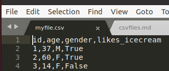
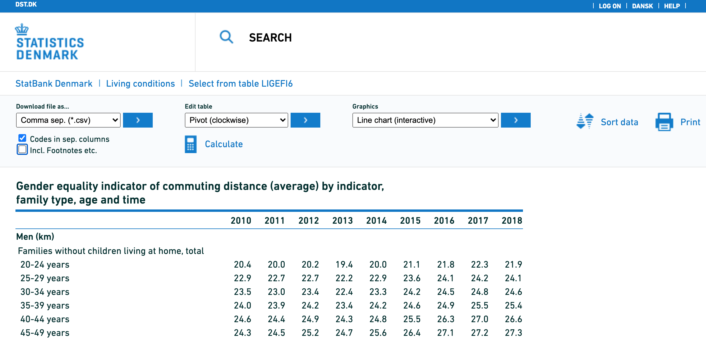

# Dealing with CSV files

*Damian Trilling and Penny Sheets*

## What are CSV files?

CSV files are just simple text files that represent tables by separating columns with a *delimiter* such as a comma (`,`), a semicolon (`;`), or a TAB character (`\t`).
Rows are separated by starting a new line.

This table:

| id | age | gender | likes_icecream |
|----|-----|--------|----------------|
| 1  | 37  | M      | True           |
| 2  | 60  | F      | True           |
| 3  | 14  | F      | False          |

could look like this as a CSV file:

```
id,age,gender,likes_icecream
1,37,M,True
2,60,F,True
3,14,F,False
```


## Reading a CSV file into pandas

If a CSV file is as simple as the example above, then rading it into pandas is really easy:
```
df = pd.read_csv("myfile.csv")
```

If your CSV file uses a different delimiter, such as a semicolon, then this won't work. Well, it will work, but then everything will end up in one column. Luckily, you can easily change that:

```
df = pd.read_csv("myfile.csv", delimiter = ';')
```

We can also change other things. For example, if our CSV file does not contain any column labels in the first row, but immediately starts with data, then we can write 

```
df = pd.read_csv("myfile.csv", header = None)
```


## Inspecting CSV files and fixing errors
Because CSV files are just plain text files, you can open them in any text editor and directly fix things in there. For instance, if the first (or any other) row is incorrect, just change it! Also, if you don't know what delimiter is used - just look at it and fix the issue. Good text editors are [Sublime](https://www.sublimetext.com/) or [Notepad++](https://notepad-plus-plus.org/).

This is how sublime looks like:




### Example

Go to https://www.statbank.dk/ and download a table as a CSV file.
Select `Comma sep (*.csv*)` as file type, and play around with the options you have:


Open the CSV file in a text editor and check out what happens if you add the footnotes or do not choose `code in sep. columns`. Do you see how you could fix it?


### Encoding issues
A particular annoying issue are so called *encoding errors*. An encoding is nothing else than a table that tells your computer which bytes represent which character. Nowadays, textfiles usually use something called *Unicode*, and more specificially the `UTF-8 encoding`. This allows you to mix all scripts of the world, including emoticons. Unfortunately, some programs still use outdated encodings (with names such as "Windows 1252") when creating CSV files. Microsoft Excel is notrious in that, and it usually results in characters that are not supported by the other encoding to be replaced by unreadable gibberish. 

So, *don't* open a CSV file in Excel and save it! Big chance Excel messes things up (it also changes your delimiter based on your system's settings without asking you!)

If you have a file that uses a different encoding than UTF-8, you can tel pandas that:
```
pd.read_csv('myfile.csv', encoding='windows-1252')
```

A better way, though, is to fix the encoding.

In Sublime, you can select `File/Open with Encoding` to force Sublime to use a specific encoding when reading a file. But often, it also guesses the encoding correctly when you just do `File/Open`. Most crucially, though, you can now do `File/Save with Encoding` to force Sublime to change the encoding to UTF-8.

Other advanced text editors like Notepad++ have comparable functionalities.